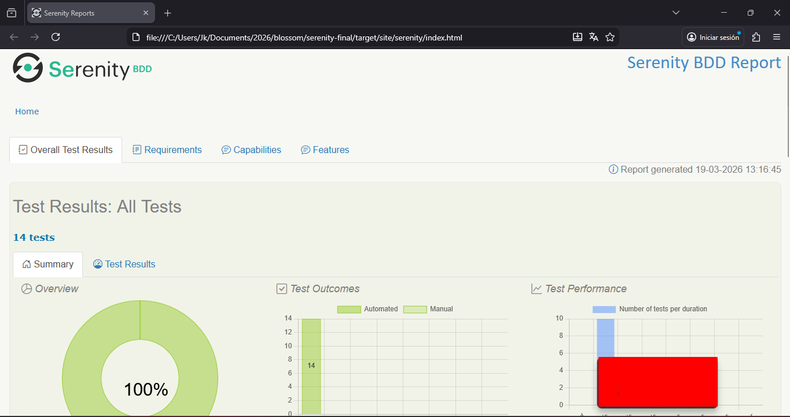
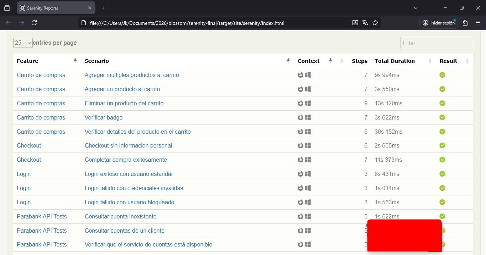

# SauceDemo Automation Framework - Final Version

## 📋 Description
Professional test automation framework built for the technical assessment, covering:
- **UI Testing**: [SauceDemo](https://www.saucedemo.com) e-commerce platform
- **API Testing**: [Parabank](https://parabank.parasoft.com) banking API

### 🎯 Key Features
- ✅ 14 automated test cases (UI + API)
- ✅ Screenplay pattern implementation
- ✅ BDD with Cucumber (Gherkin)
- ✅ Parallel execution ready
- ✅ CI/CD with GitHub Actions
- ✅ Detailed Serenity reports

## 🛠️ Technology Stack Justification

| Technology | Version | Justification |
|------------|---------|---------------|
| **Java 21** | 21 LTS | Long-term support, mature ecosystem, team alignment |
| **Serenity BDD** | 4.2.34 | Living documentation, Screenplay pattern, multi-layer testing |
| **Cucumber** | 7.21.1 | Business-readable tests, BDD approach, stakeholder collaboration |
| **JUnit 4** | 4.13.2 | Stable runner for Serenity + Cucumber integration |
| **Rest Assured** | 5.5.0 | Domain-specific language for API testing, seamless Serenity integration |
| **Maven** | 3.9+ | Dependency management, build lifecycle standardization |
| **GitHub Actions** | - | Native CI/CD integration, artifact management |

## 🎯 Test Coverage (14 Scenarios)

### UI Tests (SauceDemo) - 10 Scenarios
| Feature | Scenarios | Coverage | Tags |
|---------|-----------|----------|------|
| **Login** | 3 (2 negative) | Happy path + locked user + invalid credentials | `@login` |
| **Shopping Cart** | 4 | Add single/multiple items, remove items, verify details | `@cart` |
| **Checkout** | 2 (1 negative) | Complete purchase, missing information | `@checkout` |
| **Cart Badge** | 1 | Visual verification | `@cart` |

### API Tests (Parabank) - 4 Scenarios
| Scenario | Method | Expected | Business Value |
|----------|--------|----------|----------------|
| Account availability | GET | 200 | Core service health check |
| Customer accounts | GET | 200 | Data retrieval validation |
| Failed transfer | POST | 400 | Business rule (insufficient funds) |
| Non-existent account | GET | 400 | Error handling validation |

## 🚀 Quick Start

### Prerequisites
- Java JDK 21 ([Download](https://adoptium.net/))
- Maven 3.9+ ([Download](https://maven.apache.org/))
- Git ([Download](https://git-scm.com/))
- Firefox browser (recommended for local execution)

### Installation
```bash
# Clone repository
git clone https://github.com/jeancarls-t/saucedemo-final.git
cd saucedemo-final

# Run all tests
mvn clean verify

# Run specific test groups
mvn clean verify -Dcucumber.filter.tags="@smoke"     # Critical flows only
mvn clean verify -Dcucumber.filter.tags="@api"       # API tests only
mvn clean verify -Dcucumber.filter.tags="not @api"   # UI tests only
```

## 📊 Test Reports

After execution, reports are available at:
- **Serenity Report**: `target/site/serenity/index.html`
- **Cucumber Report**: `target/cucumber-html-report.html`
- **Surefire Report**: `target/surefire-reports/`

```bash
# Open Serenity report (Windows)
Start-Process "target/site/serenity/index.html"

# Open Serenity report (Linux/Mac)
open target/site/serenity/index.html
```

## 🏗️ Architecture Overview

```
src/test/java/com/saucedemo/
├── runners/          # Test execution configuration
├── steps/            # Cucumber step definitions
├── tasks/            # Screenplay actions (Login, AddToCart, etc.)
├── questions/        # Screenplay verifications
├── user_interfaces/  # Page Objects / UI mappings
└── helpers/          # Utility classes (BrowserHelper)

src/test/resources/
├── features/         # Gherkin feature files
└── junit-platform.properties
```

## 🔄 CI/CD Pipeline

### GitHub Actions Workflow
```yaml
Triggers: push, pull_request, manual dispatch
Environment: ubuntu-latest
Java: 21 (Temurin)
Steps:
  - Code checkout
  - Maven build & test
  - Report generation
  - Artifact storage
```

**Note**: Due to browser driver limitations in headless environments, the CI pipeline focuses on:
- ✅ Build verification (compilation)
- ✅ API tests execution
- ℹ️ UI tests run locally (see execution instructions)

## 📈 Design Patterns & Best Practices

### Screenplay Pattern
- **Tasks**: Encapsulate user actions (e.g., `Login.withCredentials()`)
- **Questions**: Perform verifications (e.g., `CartQuestions.itemCount()`)
- **Page Objects**: Centralize UI element definitions

### SOLID Principles Applied
- **Single Responsibility**: Each class has one clear purpose
- **Open/Closed**: New test cases don't require modifying existing code
- **Interface Segregation**: Focused, minimal interfaces

## 🔍 Troubleshooting

### Common Issues

| Issue | Solution |
|-------|----------|
| Chrome security alert | Use Firefox locally (recommended) |
| Tests fail in CI | Verify browser drivers or run API tests only |
| Port conflicts | Change port in `serenity.properties` |
| Slow execution | Increase timeouts in configuration |




## 📚 Additional Documentation

- **Strategy Document**: [`ESTRATEGIA.md`](ESTRATEGIA.md) (English/Spanish)
- **CI/CD Configuration**: [`.github/workflows/ci.yml`](.github/workflows/ci.yml)
- **Serenity Reports**: Generated after each run

## 🤝 Contributing Guidelines

1. Follow Screenplay pattern conventions
2. Write feature files in clear Gherkin
3. Run tests locally before submitting PR
4. Include both positive and negative scenarios
5. Update documentation when adding features

## 📄 License

This project is created for a technical assessment. All rights reserved.

## ✨ Author

**Jean Caro**
- GitHub: [@jeancarls-t](https://github.com/jeancarls-t)
- Email: jeancarlst28@gmail.com
- Role: Test Automation Engineer

---

*Last Updated: March 19, 2026*
